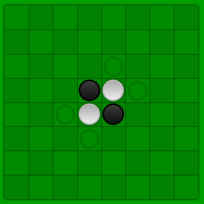

# Zadanie 2 - Reversi
B-OOP 2022

_English version of the assignment can be found at the end of this document._

Vašou úlohou je naprogramovať hru Reversi ako oknovú aplikáciu v jazyku Java s pomocou knižníc AWT a Swing. Používateľské rozhranie aplikácie má pozostávať z:

* canvasu (alebo JPanel) - ktorý bude tvoriť hernú plochu
* bočné menu (jeho umiestnenie si zvoľte sami, teda môže byť aj hore, alebo dole)
## Pravidlá hry
### Základná pozícia a cieľ hry

Hra je známa aj pod názvom Othello. Hra bude začínať na hracej ploche veľkosti 6x6 polí, a bude možné jej veľkosť meniť (na obrázku je znázornená veľkosť 8x8).

Cieľom hry Reversi je mať na hracej ploche viac kameňov ako súper. Hra končí, ak sú všetky štvorce obsadené kameňmi alebo ak žiadny z hráčov nemôže urobiť platný ťah.

### Umiesťnovanie kameňov
Ak je hráč na ťahu, umiestni kameň svojej farby na hraciu plochu. Kamene nie je možné ukladať kdekoľvek - každým ťahom musíte zajať jeden alebo viac súperových kameňov, ktoré zmenia farbu a stávajú sa kameňmi aktuálneho hráča. Pokiaľ hráč nemôže v danej pozícii zajať žiaden súperov kameň, musí prenechať ťah súperovi.
Na začiatku hry sú 4 kamene umiestnené na hracej ploche, pričom dve sú bieleho a dve čierneho hráča (viď rozloženie na obrázku vyššie).

### Ako zajať súperove kamene
Hráč musí umiestniť kameň tak, aby obkľúčil svojimi dvoma kameňmi súvislý rad súperových kameňov, a to v ľubovoľnom smere (vodorovne, zvisle alebo uhlopriečne).
Všetky obkľúčené súperove kamene sú zajaté hráčom a zmenia farbu.

Pokiaľ žiaden hráč nevie zahrať platný ťah, hra končí.

Zdroj:

[BrainKing](https://brainking.com/sk/GameRules?tp=9)

[Hra samotná](https://cardgames.io/reversi/)
## Požiadavky
Hru hrá jeden hráč proti počítaču. Môžete sa rozhodnúť, ktorá farba patrí hráčovi a ktorá počítaču. Počítač môže hrať dvoma spôsobmi:

* Náhodný ťah z možných ťahov (Penalizácia 1 bod)
* Ťah, ktorým zajme súperovi najviac kameňov (Ak je takýchto ťahov viac môžete medzi nimi rozhodnúť ľubovoľným spôsobom)

Hra má byť hrateľná pomocou myši, keď myšou prejdem ponad pole na ktoré smieme umiesniť kameň, dané pole sa musí zvýrazniť. Všetky polia na ktoré vieme umiestniť kameň sú automaticky nejako vyznačené.
V menu sa má nachádzať:
* informácia o tom, ktorý hráč je na ťahu, poprípade keď hra skončí, ktorý hráč vyhral.
* tlačidlo, ktorým vieme hru zresetovať.
* informáca hovoriaca o aktuálnom rozmere hracieho plánu.
* komponent pomocou ktorého je možné zmeniť veľkosť hracej plochy (iba na hodnoty 6,8,10,12). Konkrétny komponent si môžete zvoliť sami, napríklad jeden z: Slider, JTextField, JComboBox

Stlačením klávesy R na klávesnici vieme tiež hru reštartovať, a pomocou klávesy ESC vypnúť.

## Hodnotenie

Zadanie je hodnotené 15 bodmi. 5 bodov je za funkčnosť zadania, 5 bodov za Princípy OOP a 5 bodov za správne používanie knižnice SWING. **Odovzdaný program musí byť skompilovateľný, inak je
hodnotený 0 bodmi**. Skompilovateľnosť zadania kontroluje aj github pipeline. Hlavný dôraz v hodnotení sa kladie na objektový prístup a princípy,
okrem iného:

* vhodné pomenovanie tried a metód v jednotnom jazyku (názvy tried s veľkým počiatočným písmenom, názvy metód s malým),
* vhodné použitie modifikátorov prístupu (public, private, poprípade protected) na obmedzenie prístupu k metódam a atribútom,
* využitie dedenia a polymorfizmu,
* použitie výnimiek na ošetrenie nedovoleného správania (nehádzať a nezachytávať všeobecnú triedu Exception),
* nepoužívajte nested classy,
* vo vašich triedach nevytvárajte statické metódy ani nekonštantné statické premenné (v zadaní nie sú potrebné),
* v hlavnej triede (main) nevytvárajte žiadnu logiku, iba vytvorte nový objekt.
* vo svojom riešení môžete použiť knižnicu lombok a jej anotácie. Potrebná dependencia je už pridaná v _pom.xml_ súbore.

Niektoré z vecí, za ktoré sme minulý rok strhli po 0,5 - 1 bode:

* Po spustení je okno prázdne, vykreslí sa až po resize
* Nie je nastavená počiatočná velkosť okna
* Nie je naimplementovaný niektorý z listenerov
* Nefunguje reset
* Chybné vykreslovanie
* Neodchytené exceptions
* Nenastavený exit okna
* Nesprávna detekcia výhry
* Kód v main metóde
* Nevyužitie OOP princípov
* Po resete prestane fungovať niektorý z listenerov
* Otvaranie noveho okna pri resete
* Listenery ako Nested Triedy
* Hra sa nedá dohrať
* Frame.setVisible je zavolaný moc skoro

Prípadne sú pri nedostatočnej implementácií struhnuté body za OOP za nedostatočnú implementáciu.

**Pri zadaní sa kontroluje originalita zadaní, a všetky zadania so zhodou vyššou ako 80% sú hodnotené 0 bodmi.**

## Odovzdávanie
Zadanie si naklonujte z repozitára zadania výhradne pomocou poskytnutej linky cez GitHub Classroom (pokiaľ si vygenerujete vlastný repozitár pomocou tlačidla "Use this template" z template repozitára, my váš repozitár neuvidíme a nebudeme ho hodnotiť!). Svoje vypracovanie nahrajte do pre vás vytvoreného repozitára pre toto zadanie pomocou programu Git (git commit + git push).
Skontrolujte si, či sa váš repozitár nachádza pod skupinov **Interes-Group**, inak nemáme prístup ku vášmu repozitáru a zadanie sa nepovažuje za odovzdané. Vypracovanie môžete "pusho-vať" priebežne. Hodnotiť sa bude iba _master_ branch. Zadanie je nutné vypracovať do **15.4.2022 23:00**.

V projekte upravujte iba súbory v priečinku _src/main_ a jeho podpriečinkoch. Ostatné súbory je upravovať zakázané (predovšetkým súbory _pom.xml_, súbory obsahujúce github pipeline-y a súbory obsahujúce automatizované testy).

Vo svojom github účte si nastavte svoje meno alebo AIS login (settings > profile > name), aby bolo možné priradiť riešenie ku študentovi. **Pokiaľ nebude možné spárovať študenta s riešením je zadanie hodnotené 0 bodmi!**

# Assignment 2 - Reversi
B-OOP 2022

Your task is to create a window Java application running the game Reversi using the AWT and Swing libraries. The user interface of the application must consist of:

* Canvas (or JPanel) - that will draw the game board
* side menu (you can choose the placement of this menu, it can also be on the top, or at the bottom of the window)

## Game rules
### Starting position and the win condition

The game is also known as Othello. The game starts with a board of 6x6 tiles, the size of the board can be changed by the user (the picture shows a board od size 8x8).

The goal of the game is to have more stones on the board than your opponent. The game ends if all tiles are occupied by stones, or if neither player can play a valid move.

### Placing the stones
The player places a stone of their color onto the board on their turn. The stone must be placed in such a way, that it captures at least one stone of their opponent. If a player cannot capture a stone with any available move, they pass their turn.
The game begins with 4 stones placed on the board, two stones belong to the white and two stones belong to the black player (see picture above).

### Capturing stones
The players must place stones in such a way, that they trap opposing stones in a continuous line between two stones of their own color in any direction (vertically, horizontally, or diagonally).
All the trapped stones are captured by the player and change color.

If neither player can make a capturing move the game ends.

Source:

[BrainKing](https://brainking.com/en/GameRules?tp=9)

[Online version of the game](https://cardgames.io/reversi/)
## Requirements
The game is played against a computer opponent. You can decide which color is played by the player and which by the computer. The computer can play in two ways:

* By playing a random valid move (Penalisation of 1 point)
* By playing the move that captures the most stones (If there are more such moves you can choose one in any way you want)

The game is played with the mouse. When a mouse hovers above a tile that is a valid move, this tile is highlighted. All the tiles that are valid moves are highlighted.

The menu must contain:
* information about the current player, or when the game ends, information about the winner.
* a button that resets the game
* information about the current dimensions of the board
* a component that is used to set the size of the game board (out of the valid values 6,8,10,12). You can choose what component to use for this, possible examples include: Slider, JTextField, JComboBox

By pressing the R key on the keyboard the game resets. By pressing the ESC key the game closes.

## Grading
You can get 15 points for this assignment. 5 points are given for fulfilling the outlined rules of the game, 5 points are given for complying with OOP principles, 5 points are given for correct usage of the AWT and Swing libararies.
**The program must be able to compile, otherwise 0 points are given for the assigment.**
The github pipeline checks whether the program can be compiled. The main focus during grading is put on object-oriented approach and OOP principles used by the solution.
Including, but not limited to:
* appropriate naming of classes, methods and variables in a single language (class names starting with a capital letter, method names starting with a lowercase letter),
* appropriate use of access modifiers (public, private, or protected) when restricting access to class methods and attributes,
* the use of inheritance and polymorphism,
* usage of exceptions when handling undesired behavior (do not catch or throw the instances of the generic Exception class),
* don't use nested classes,
* don't use static methods, or non-constant static variables (you don't need them to complete the assignment),
* don't put any logic into the main method and its class. The main method should only be used to create a new object,
* you can use the lombok library and its annotations in your solution. The neccessary dependency is already present in the pom.xml file.

Issues that resulted in a 0.5 - 1 point reduction last year:

* The application shows an empty window when it starts and the content is displayed only after the window is resized
* The initial dimensions of the window are not set
* Some of the required listeners are not implemented
* The game cannot be reset
* Drawing glitches
* Uncaught exceptions
* The program does not exit, when the window closes
* The win condition is not checked correctly
* Code in the main method
* Lack of OOP principles
* Some of the listeners are broken after the game resets
* A new window is opened when the game resets
* Listeners are implemented with nested classes
* The game cannot be finished
* Frame.setVisible is called too early

If the assignment lacks a substantial part of the specified functionality additional points are substracted.

**The originality of the code is checks, all assignments with a more than 80% match are awarded with 0 points.**

## Handing in the assigment

Clone the assignment from the repository created from this template by the provided link trough GitHub Classroom (if you create your own repository with the "use this template" button, we won't be able to see your repository, and we won't be able to grade it!). Upload your solutions to your repository using the Git version control system (git commit + git push).

Make sure, that your repository was created under the **Interes-Group** group, otherwise we won't be able to access your repository, and the assignment will not be graded.

You can push commits to the repository while you work - you don't have to push everything at once. Only the code in the _master_ branch will be graded. You have until **15.4.2022 23:00** to complete the assignment.

Only edit files in the _src/main_ folder or its sub-folders. You mustn't change any other files in the repository (especially the _pom.xml_ file, and the github pipeline files).

You have to have your name set in your github account (settings > profile > name), so that we can match students with their assignments. **If we are unable to match a student with their assignment, the student will receive 0 points for the assignment!**